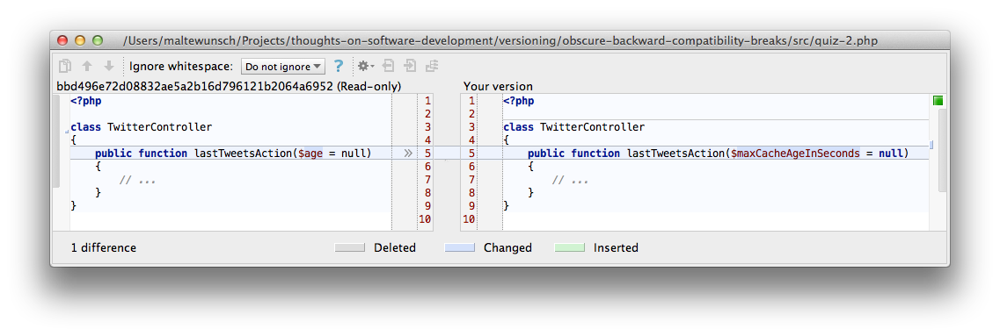

Obscure Backward Compatibility Breaks
=====================================

[SemVer](http://semver.org/) is great. If you find yourself packetizing your code for reuse, I strongly suggest you
adhere it and state that you do. It makes the lifes of all parties depending on your package a lot easier, especially
with dependency managers like [Bower](http://bower.io/) and [Composer](https://getcomposer.org/) that support the
[tilde operator](https://getcomposer.org/doc/01-basic-usage.md#next-significant-release-tilde-operator-).

A lot of the decisions in SemVer come down to backwards compatibility breaks of your API, or "bc breaks" for short.
SemVer states:

> For this system to work, you first need to declare a public API. This may consist of documentation or be enforced by
> the code itself. Regardless, it is important that this API be clear and precise.

You may wonder what counts as your API, and how to make it clear and precise. Let's have a little quiz: Which of the
following four changesets is a bc break? (Forgive me to include two Symfony2 specific questions)





Well, that was a trick question, of course. All of these changesets can be seen as bc breaks of the API, for suitable
definitions of "API". Here's why.


Changing HTML Markup
--------------------
Stylesheets of third parties including your HTML may not continue working as expected.


Renaming an Input Variable in a Symfony2 Controller Action
----------------------------------------------------------
The old parameter names could have been passed for mapping purposes. E.g. somebody may have something like this in their
Twig view:

```twig
{{
    render_esi(
        controller(
            "WebfactoryTwitterBundle:Twitter:lastTweets",
            {'age': 120}
        )
    )
}}
```


Adding new Routes in Symfony2
-----------------------------

Adding routes is a new feature at best, you may argue? But consider that someone might have used that route before and
that your nee route may take precedence.


Introducing a Protected Method in a Class that's not Final
----------------------------------------------------------

Someone may have extended your class and already added a protected method with the same name but a different purpose. If
so and if the inherited method doThis() is called on an object of the subclass, your new implementation kicks in, calls
the doThat() of the subclass and gets an unexpected result, which may cause all sorts of trouble.


Obscure Edge Cases?
===================

Are these examples too obscure? Depends on what you declared as your stable API. And if you haven't declared your API
explicitly (because you thought it would result directly from the code) you may want to reconsider. How to do declare
your API in a clear precise way? [E.g. Symfony2 uses an @api annotation](http://symfony.com/doc/current/book/stable_api.html).

Are these examples only edge cases not worth the work? Let me tell you I've already stumbled upon the first three of
them. The fourth one is waiting to happen in this or some other form. Which is an argument for having less implicit
extension points, e.g. by [declaring classes final by default - a controversial topic for another time](https://groups.google.com/forum/#!topic/dddinphp/r9kZ5eI6eiw).


---

Do you know other obscure BC breaks? Please, let me know at [+MalteWunsch](https://www.xing.com/profile/Malte_Wunsch) or
[@MalteWunsch](https://twitter.com/MalteWunsch).

[Imprint](../../imprint.md)
